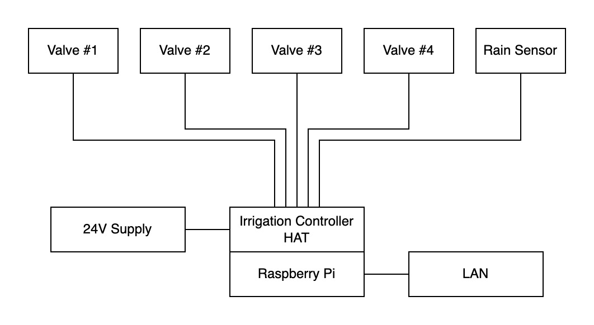

# Irrigation Controller

This repository contains the software, hardware design, and documentation of a smart irrigation controller. The system is designed and created for personal use.

## Features
- Automated irrigation using 4 solenoid valves.
- Configuration and control through web interface.
- Suspension of irrigation when it's raining.
- Short-circuit detection.
- DIN rail mounting.
